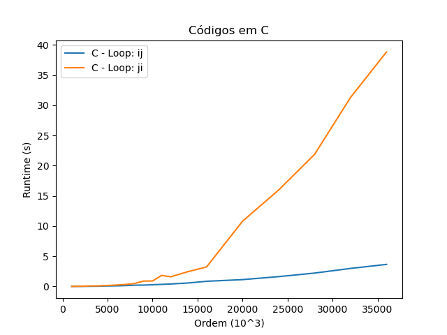
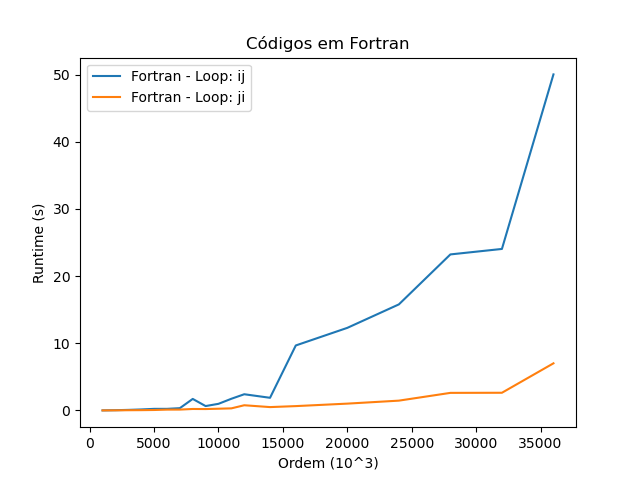
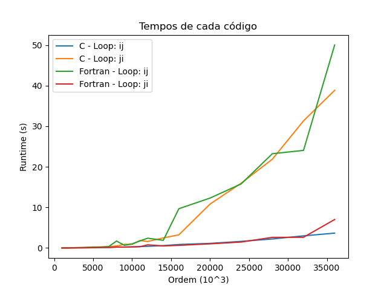

# COC472 - Computação de Alto Desempenho

## Trabalho 01: Multiplicação de matrizes

### Descrição do trabalho
O objetivo do primeiro trabalho é criar projetos que devem realizar o produto Matriz-Vetor, `A * x = b` e estimar o desempenho dos mesmo e comparar os tempos de execução e o impacto da ordem dos loops aninhados no desempenho.

### Requisitos
- Os projetos devem ser feitos nas linguagens `C` e `Fortran`;
- Os arrays utilizados durante as operações devem ser aleatórios;

## Questões a serem respondidas

#### Estimando limites
> Estime o tamanho máximo dos arrays A, x e b que podem ser alocados no seu sistema para realização da tarefa.

Utilizando os tipos `double` e `REAL(8)` (em `C` e `Fortran`, respectivamente), o cálculo para o tamanho máximo de uma matriz A é: `tamanho_matriz = 8 bytes * ordem * ordem` e para cada um dos vetores é `tamanho_vetor = 8 bytes * ordem`.

Considerando que minha máquina possui, no total 16GB, podemos encontrar a maior ordem possível por:
```
2^30 * (total_memória) = tamanho_matriz + 2 * tamanho_vetor
2^30 * 16 = 8 * ordem * ordem + 2 * (ordem * 8)
ordem^2 + ordem = 2^31
ordem (ordem + 1) = 2^31
```

Resolvendo a equação, temos que a ordem máxima é na casa de 46000.

Porém, esse valor não leva em consideração a memória utilizada pelo SO e outros processos da máquina.

#### Aleatoriedade
> Os arrays a serem utilizados durante as operações devem ser inicializados com números aleatórios.

Os arrays podem ser gerados utilizando o script `create_samples.py` na pasta `src/utils/`.

#### Escalando o problema
> Comece com um problema de tamanho pequeno e tente chegar ao tamanho máximo estimado no item 1. Contabilize o tempo para realiação das operações para todos os tamanhos de sistema e para ambas as ordens de execução dos loops.

Como criei um arquivo para cada array, a abordagem trouxe consigo uma limitação de espaço em disco, portanto, os arquivos de tempo contam apenas com sistemas de ordem 12000.
Os arquivos de sistemas são gerados da seguinte forma: `[ORDEM].matrix` e `[ORDEM].vector`. As ordens testadas seguem a sequência seguinte:
- `1000` a `12000`, incremento de `1000`;
- `14000`;
- `16000` a `36000`, incremento de `4000`;

#### Curvas
> Apresente curvas mostrando o tempo de execução para cada dimensão do problema e relacione estas curvas à complexidade computacional do produto matriz - vetor `(O(n^2))`.

- C:



- Fortran:



- Todos os métodos e linguagens:



Analisando os gráficos, podemos concluir que há uma perda de performance significativa quando é a ordem `ji` é utilizada no código em `C` e que o oposto (queda de performance com a ordem `ij`) acontece com a linguagem `Fortran`. Essa diferença se dá pela forma em que as matrizes são armazenadas em cada uma das linguagens. Este é o próximo assunto a ser discutido.


#### Organização dos arrays
> Explique como o modo em que os arrays são armazenados nas duas linguagens afetam os resultados.

A abordagem do `Fortran` de armazenamento contínuo, ou seja, um grande array, é menos otimizada pois o acesso ao valor contido na matriz, acontece de maneira mais espaçada. A abordagem da linguagem `C`, por outro lado, requer uma leitura sequencial dos dados, que acaba tornando o processo menos custoso. Esta diferença fica mais clara quando comparamos as curvas `Ordem x Tempo de execução` vista na questão anterior e as ordens de execução dos loops aninhados: a leitura sequencial de dados ocorre na ordem `ij` no código em `C` e na ordem `ji` no código em `Fortran`.

### Como executar o projeto?

> Makefile em produção.

### Observações gerais

- O arquivo `times.csv` possui o seguinte cabeçalho:
  - `ORDER,LANG,LOOP_ORDER,TIME`, onde:
	- `ORDER` é a ordem da matriz A.
    - `LANG` é a linguagem utilizidada.
	  - Possíveis valores: `C` e `Fortran`
	- `LOOP_ORDER` é a ordem de aninhamento do loop.
	  - Possíveis valores: `IJ` e `JI`
	- `TIME` é o tempo de execução da função.
	  - O cálculo é feito pelos próprios programas utilizando `tempo_final - tempo_inicial`

- Devido ao tamanho dos arquivos de matrizes e vetores, eles não estão contidos no repositório, porém podem ser gerados utilizando o script `create_samples.py`.


### Dependências

- `gcc`
- `gfortran`
- `python3`
- `pandas`
- `matplotlib`
